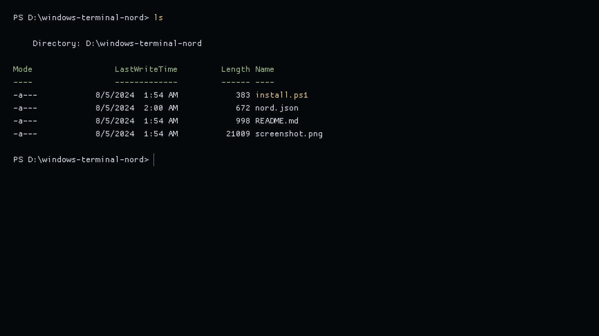

# nord-windows-terminal

<p align=center>Nord Theme for Windows Terminal with more contrast dark background.</p>

## Install

### Easy Install

Run the `install.ps1` PowerShell script to install the colorscheme via [Windows Terminal JSON Fragments](https://docs.microsoft.com/en-us/windows/terminal/json-fragment-extensions#where-to-place-the-json-fragment-files)
```powershell
 .\install.ps1
```
> 
> **Note**
> To allow the execution of the installation script without having to relax the [Execution Policy][ps-execpolicy] of the entire system, you can unblock the `install.ps1` file using the [Unblock-File][ps-unblockfile] PowerShell cmdlet.
>
> ```powershell
> Unblock-File .\install.ps1
> ```

[ps-execpolicy]: https://docs.microsoft.com/en-us/powershell/module/microsoft.powershell.security/set-executionpolicy?view=powershell-7.2
[ps-unblockfile]: https://docs.microsoft.com/en-us/powershell/module/microsoft.powershell.utility/unblock-file?view=powershell-7.2
